# 系統規格說明書 - 世界名畫展示館

## 專案概述
世界名畫展示館是一個互動式的數位藝術瀏覽平台，提供沉浸式的名畫欣賞體驗。

## 技術選型分析

### 最終選擇：原生 JavaScript + GSAP + 現代 Web API
**選擇理由**：
- 最大靈活性和性能控制
- 無框架依賴，載入速度快
- 完全自定義的用戶體驗
- 易於維護和擴展

### 用戶交互設計架構

```mermaid
graph TD
    A[用戶界面層] --> B[交互控制層]
    B --> C[搜索與篩選系統]
    B --> D[收藏與個人化]
    B --> E[社交分享功能]
    B --> F[無障礙支援]
    C --> G[數據處理層]
    D --> G
    E --> G
    F --> G
    G --> H[本地存儲管理]
    G --> I[動畫渲染引擎]
    I --> J[視覺回饋系統]
```

## 用戶交互設計規格

### 核心交互功能

#### 1. 智能搜索與篩選系統
- **功能描述**：提供多維度的畫作搜索和篩選
- **實現方式**：
  - 即時搜索建議
  - 藝術家、年代、風格篩選
  - 模糊搜索支援
  - 搜索歷史記錄

#### 2. 個人化收藏系統
- **功能描述**：用戶可收藏喜愛的畫作
- **實現方式**：
  - 本地存儲收藏清單
  - 收藏狀態視覺回饋
  - 收藏畫作快速瀏覽
  - 收藏統計與分析

#### 3. 社交分享功能
- **功能描述**：分享畫作到社交媒體
- **實現方式**：
  - 原生分享 API
  - 自定義分享卡片
  - 複製連結功能
  - 下載高解析度圖片

#### 4. 沉浸式瀏覽模式
- **功能描述**：全螢幕無干擾瀏覽
- **實現方式**：
  - 全螢幕 API
  - 自動播放模式
  - 手勢控制支援
  - 環境音效

### 無障礙設計規範

#### 鍵盤導航
- Tab 鍵順序邏輯
- 快捷鍵支援
- 焦點視覺指示

#### 螢幕閱讀器支援
- ARIA 標籤完整性
- 語義化 HTML 結構
- 圖片替代文字

#### 視覺輔助
- 高對比度模式
- 字體大小調整
- 色盲友善設計

### 效能優化策略

#### 圖片載入優化
- 懶載入技術
- 漸進式圖片載入
- WebP 格式支援
- 圖片壓縮與快取

#### 動畫效能
- GPU 加速動畫
- 防抖與節流
- 記憶體管理
- 電池優化模式

## UML 圖表

### 系統流程圖

## 1. 系統流程圖

## 2. 循序圖 (Sequence Diagram)

## 3. 類別圖 (Class Diagram)

## 4. 關聯圖 (ER Diagram)

