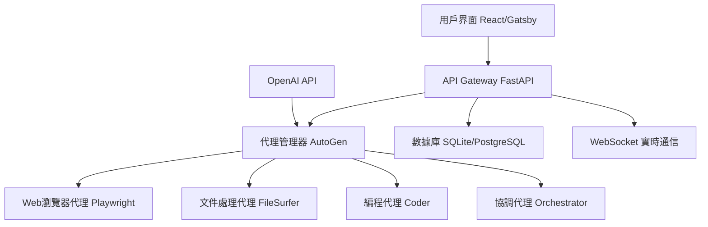
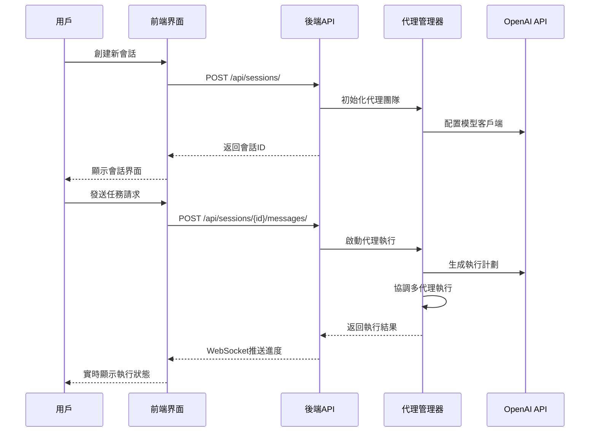

# Magentic-UI 項目規範文檔

## 📋 項目概述

**Magentic-UI** 是一個基於多代理系統的人機協作Web自動化平台，提供直觀的用戶界面來管理和執行複雜的自動化任務。

### 🎯 核心目標
- 提供易用的多代理協作界面
- 支援複雜的Web自動化任務
- 實現人機協作的工作流程
- 提供可擴展的代理架構

## 🏗️ 系統架構

### 技術棧
```
前端: React + Gatsby + TypeScript
後端: Python 3.10+ (FastAPI + AutoGen)
數據庫: SQLite (可配置PostgreSQL)
容器化: Docker (瀏覽器環境 + Python執行環境)
認證: JWT令牌認證系統
```

### 架構圖


## 🔄 工作流程

### 會話生命週期


## 🧩 核心組件

### 1. 前端組件架構
```
src/components/
├── layout/          # 佈局組件
├── session/         # 會話管理
├── chat/           # 聊天界面
├── settings/       # 設置面板
├── store/          # 狀態管理
└── types/          # TypeScript類型定義
```

### 2. 後端服務架構
```
src/magentic_ui/backend/
├── web/            # FastAPI應用
│   ├── routes/     # API路由
│   ├── middleware/ # 中間件
│   └── deps/       # 依賴注入
├── database/       # 數據庫管理
├── teammanager/    # 代理團隊管理
└── agents/         # 代理實現
```

### 3. 代理系統架構
```
agents/
├── orchestrator/   # 協調代理
├── web_surfer/     # Web瀏覽代理
├── file_surfer/    # 文件處理代理
├── coder/          # 編程代理
└── _base/          # 基礎代理類
```

## 🔌 API 設計

### RESTful API 端點
```yaml
# 會話管理
GET    /api/sessions/              # 獲取會話列表
POST   /api/sessions/              # 創建新會話
GET    /api/sessions/{id}          # 獲取會話詳情
DELETE /api/sessions/{id}          # 刪除會話

# 消息管理
GET    /api/sessions/{id}/messages/    # 獲取會話消息
POST   /api/sessions/{id}/messages/    # 發送新消息

# 執行管理
POST   /api/runs/                  # 啟動新執行
GET    /api/runs/{id}              # 獲取執行狀態
POST   /api/runs/{id}/stop         # 停止執行

# WebSocket
WS     /api/ws/runs/{id}           # 實時執行狀態
```

### 數據模型
```python
# 會話模型
class Session(BaseModel):
    id: int
    name: str
    user_id: str
    created_at: datetime
    updated_at: datetime
    team_id: Optional[int]

# 消息模型
class Message(BaseModel):
    id: int
    session_id: int
    content: str
    role: Literal["user", "assistant"]
    timestamp: datetime

# 執行模型
class Run(BaseModel):
    id: int
    session_id: int
    status: Literal["running", "completed", "failed"]
    result: Optional[dict]
    created_at: datetime
```

## 🔒 安全設計

### 認證與授權
- JWT令牌認證
- 用戶會話隔離
- API密鑰安全存儲
- CORS跨域保護

### 數據安全
- 敏感數據加密存儲
- 文件訪問權限控制
- 執行環境沙箱隔離

## 🚀 部署架構

### 開發環境
```bash
# 前端開發服務器
npm run develop  # http://localhost:8000

# 後端API服務器
magentic ui --port 8081 --reload
```

### 生產環境
```bash
# 統一服務器部署
magentic ui --port 8081
# 訪問: http://localhost:8081
```

### Docker部署
```yaml
version: '3.8'
services:
  magentic-ui:
    build: .
    ports:
      - "8081:8081"
    environment:
      - OPENAI_API_KEY=${OPENAI_API_KEY}
    volumes:
      - ./data:/app/data
```

## 📊 性能指標

### 響應時間要求
- API響應: < 200ms
- 頁面加載: < 2s
- WebSocket延遲: < 100ms

### 併發處理
- 支援100+併發會話
- 代理執行隊列管理
- 資源使用監控

## 🧪 測試策略

### 測試層級
1. **單元測試**: 代理功能測試
2. **集成測試**: API端點測試
3. **端到端測試**: 完整工作流程測試
4. **性能測試**: 負載和壓力測試

### 測試覆蓋率目標
- 後端代碼: > 80%
- 前端組件: > 70%
- API端點: 100%

## 📈 監控與日誌

### 日誌系統
- 結構化日誌記錄
- 多級別日誌輸出
- 錯誤追蹤和報警

### 監控指標
- 系統資源使用率
- API響應時間
- 代理執行成功率
- 用戶活躍度

## 🔄 版本控制

### 語義化版本
- 主版本: 重大架構變更
- 次版本: 新功能添加
- 修訂版本: 錯誤修復

### 發布流程
1. 開發分支功能開發
2. 測試環境驗證
3. 主分支合併
4. 生產環境部署

---

**文檔版本**: v1.0.0  
**最後更新**: 2025-05-28  
**維護者**: Magentic-UI 開發團隊
